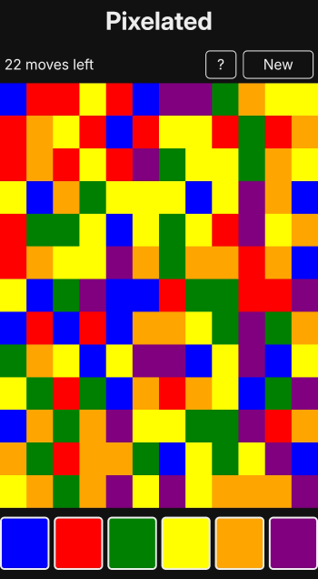

# Pixelated

An addictive game of strategy and colour!

## About

Pixelated is a puzzle-based strategy game that requires a mix of skill and luck. The objective is to change the colour of the squares until the entire screen is a single solid colour.

## How To Play

Starting with the square in the upper left corner you can change the colour of the blocks in order to match that of the surrounding squares. This is done repeatedly until the entire screen is one colour. The goal is to clear the screen in as few moves as possible. Under the default settings, you must do so in under 22 moves to win. The game is controlled by the large coloured blocks at the bottom of the screen.

## Reporting Bugs

If you come across any bugs or issues, please let me know! Feel free to open an issue or submit a pull request. Thank you!

## Technologies Used

&nbsp;&nbsp;&nbsp;&nbsp;&nbsp;&nbsp;

&nbsp;&nbsp;&nbsp;&nbsp;&nbsp;&nbsp;

&nbsp;&nbsp;&nbsp;&nbsp;&nbsp;&nbsp;

This game was developed using vanilla JavaScript, CSS, and HTML, with no external libraries, frameworks, or dependencies of any kind.

## Acknowledgements

Special thanks to [Ebscer](https://ebscer.com/) for creating the original Blackberry game, now sadly discontinued. This project serves as a tribute and spiritual successor.

## See Also

Learn more about the flood fill algorithm, commonly used in tools like the bucket tool in image editing software, and in games:

- [Flood fill (Wikipedia)](https://en.wikipedia.org/wiki/Flood_fill)

## License

Copyright (c) Michael Kolesidis  
Licensed under the [GNU Affero General Public License v3.0](https://www.gnu.org/licenses/agpl-3.0.html).
