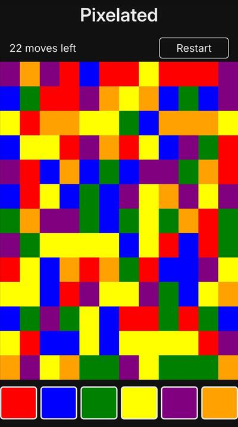

# Pixelated

An addictive game of strategy and colour!

## About

Pixelated is a puzzle based strategy game that requires a mixture of skill and luck in order to accomplish. The object of the game is to change the colour of the squares until the entire screen is a single solid colour.

## How To Play

Starting with the square in the upper left corner you can change the colour of the blocks in order to match that of the surrounding squares. This is done repeatedly until the entire screen is a single colour. The object of the game is to clear the screen in as few moves as possible. Under the default settings you must do so in under 22 moves in order to win. The game is controlled by the large colored blocks at the bottom of the screen.

## Technical Information

The game was developed using pure JavaScript, CSS, and HTML, without relying on any external libraries or frameworks.

## Acknowledgements

I would like to express my sincere thanks to [Ebscer](https://ebscer.com/) for developing the original Blackberry game. The game was eventually made available on other platforms, such as iPhone and Windows Phone, but sadly, it has since been discontinued and is no longer available for purchase. As a tribute to the original, I created this project as its spiritual successor.

## 💖 Support the Project

Thank you so much for your interest in my project! If you want to go a step further and support my open source work, buy me a coffee:

## License

Copyright (c) Michael Kolesidis  
Licensed under the [GNU Affero General Public License v3.0](https://www.gnu.org/licenses/agpl-3.0.html).
