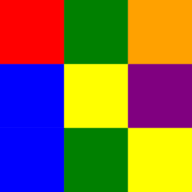

# Pixelated

An addictive game of strategy and colour!

## About

Pixelated is a puzzle-based strategy game that requires a mixture of skill and luck in order to accomplish. The object of the game is to change the colour of the squares until the entire screen is a single solid colour.

## How To Play

Starting with the square in the upper left corner you can change the colour of the blocks in order to match that of the surrounding squares. This is done repeatedly until the entire screen is a single colour. The object of the game is to clear the screen in as few moves as possible. Under the default settings you must do so in under 22 moves in order to win. The game is controlled by the large colored blocks at the bottom of the screen.

## Technical Information

The game was developed using pure JavaScript, CSS, and HTML, without relying on any external libraries or frameworks.

## Contributing

Contributions are more than welcome! Please open an issue or a pull request. Thank you

## Acknowledgements

Special thanks to [Ebscer](https://ebscer.com/) for creating the original Blackberry game, now sadly discontinued. This project serves as a tribute and spiritual successor.

## License

Copyright (c) Michael Kolesidis  
Licensed under the [GNU Affero General Public License v3.0](https://www.gnu.org/licenses/agpl-3.0.html).
